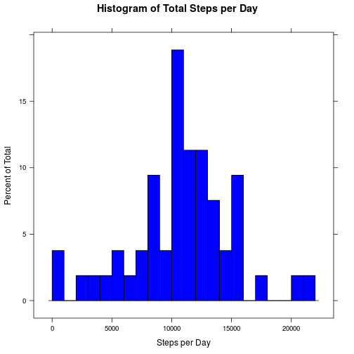
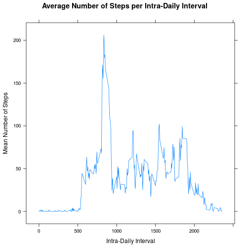
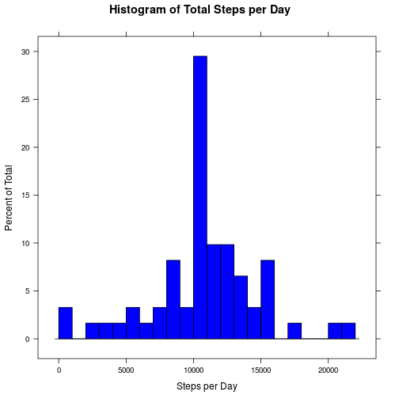
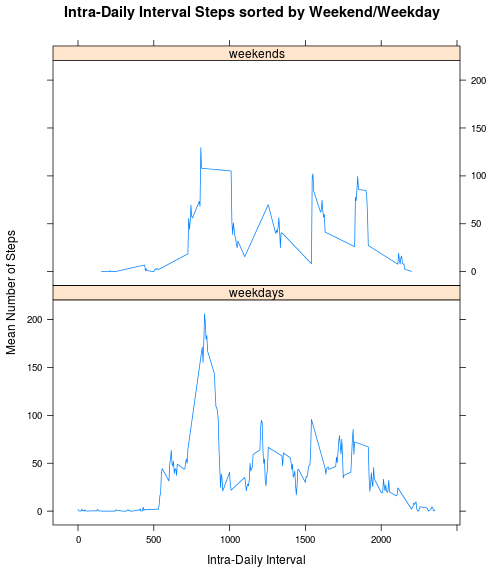

###by epigenus

###Nov 2014


## Introduction

With recent advances in technology, personal biometric monitoring devices have become feasible for the consumer market.  However, analysis and interpretation of this data is still in its infancy.  This document represents a cursory analysis of one such device from a single anonymous user.  Specifically data from the number of steps (given as a integer), taken in five minute intervals (given in hhmm format), over a number of days (in YYYY-MM-DD format), is analyzed to answer a series of questions posed in the assignment for Peer Assessment 1 of the Reproducible Research course, taught via Coursera.  This document represents the most recent commit available at the following [github repository](https://github.com/epigenus/RepData_PeerAssessment1).  Full assignment and data details can be found in the [README](https://github.com/epigenus/RepData_PeerAssessment1/blob/master/README.md) document, in the above repository.


## Loading and preprocessing the data

Throughout this analysis we will be dividing and transforming our data, for this we will require the *reshape2* library by [Hadley Wickham](https://github.com/hadley/reshape).  We will also have need to plot portions of the data analysis.  For this we will use the *lattice* graphing package by [Deepayan Sarkar](http://lattice.r-forge.r-project.org/).  The data itself is contained as a *.csv* file in the *activity.zip* archive, which we load into a dataframe called *activity*.


```r
require(reshape2)
require(lattice)
activity <- read.csv(unzip("activity.zip", exdir=tempdir()))
```

A quick view of the activity data shows us that it consists of three variables: 2 classifiers (*date* and *interval*) and one measured variable (*steps*) for each day and each intra-daily interval.  


```r
str(activity)
```

```
## 'data.frame':	17568 obs. of  3 variables:
##  $ steps   : int  NA NA NA NA NA NA NA NA NA NA ...
##  $ date    : Factor w/ 61 levels "2012-10-01","2012-10-02",..: 1 1 1 1 1 1 1 1 1 1 ...
##  $ interval: int  0 5 10 15 20 25 30 35 40 45 ...
```

We immediately see that for some intervals, on some days, the step count is missing (denoted NA). And we see that the *date* variable is not a POSIX compliant Date object.  Also, we will want the data frame to represent the classifier/measure distinction, so that we may analyse the data with respect to the days and the intra-daily intervals.

The POSIX compliancy is the only persistent preprocessing we need throughout our analysis, so we do that now. As needed we will melt the data frame (with or without missing values) to represent the classifier/measure distinction we desire.


```r
activity$date <- as.Date(activity$date)
```

For our initial analyses, the missing values represent a barrier.  Though it may or may not affect the measures of activity, we melt the data without those missing values.


```r
activitymelt <- melt(activity, id=c("date", "interval"), 
                     variable="steps", na.rm=TRUE)
```

## What is mean total number of steps taken per day?

The first question we can ask is "What is the mean number of total steps taken per day?".  Answering this question will allow us to form a baseline daily activity level (as measured by steps taken).  To accomplish this, we segment the data by dates, and sum up the total steps taken in each day. The resulting data frame, *stepsperday*, has two columns: *date* and the total number of steps during that day, labelled *dailysteps*.  


```r
stepsperday <- dcast(activitymelt, date~steps, sum)
names(stepsperday) <- c("date", "dailysteps")
```

Below is the histogram showing the frequency of total daily step count.


```r
histogram(~dailysteps, data=stepsperday, col='blue', breaks=20,
          main='Histogram of Total Steps per Day', xlab = 'Steps per Day')
```

 

We see from the histogram a pattern of daily activity with a lot of variablility.  In general the subject seems to walk a moderate amount each day, with occasional days of heavy walking or light walking.

The histogram is characterized by the mean and median values of the total steps each day.


```r
mean(stepsperday$dailysteps)
```

```
## [1] 10766
```

```r
median(stepsperday$dailysteps)
```

```
## [1] 10765
```

The median and mean being roughly equal suggests a random amount of walking each day, centered strongly on a mean and not heavily skewed overall.  This might allow us to classify any given day as an average, above average, or below average day.

## What is the average daily activity pattern?

The next question we might be interested in is, "Is there an intra-daily activity pattern?"  Or, put another way, is the subject more active at certain times of the day?

To answer this we will segment our data by the intra-daily intervals and calculate the mean number of steps taken during that interval across all days. The resulting data frame, *stepsbyinterval*, has two columns: *interval* and the mean number of steps per interval, labelled *avgsteps*
.  


```r
stepsbyinterval <- dcast(activitymelt, interval~steps, mean)
names(stepsbyinterval) <- c("interval", "avgsteps")
```

We then plot the means as a time series representing the average number of steps taken at intervals throughout the day.


```r
xyplot(avgsteps~interval,data=stepsbyinterval, type='l',
       main='Average Number of Steps per Intra-Daily Interval',
       xlab='Intra-Daily Interval', ylab='Mean Number of Steps')
```

 


From the time series plot, we see a few peak periods of activity throughout the day.  But generally the subject's most regularly active period is during the morning hours.  The following code allows us to determine the interval with the highest level of average daily activity.


```r
stepsbyinterval[which.max(stepsbyinterval[,"avgsteps"]),"interval"]
```

From this we discover that the 835 interval in the morning is the highest average peak of activity level throughout any given day.

## Imputing missing values

Now that we a have a rough idea of how the activity varies by day and by interval, we are ready to deal with the missing data points.


```r
summary(activity)
```

```
##      steps            date               interval   
##  Min.   :  0.0   Min.   :2012-10-01   Min.   :   0  
##  1st Qu.:  0.0   1st Qu.:2012-10-16   1st Qu.: 589  
##  Median :  0.0   Median :2012-10-31   Median :1178  
##  Mean   : 37.4   Mean   :2012-10-31   Mean   :1178  
##  3rd Qu.: 12.0   3rd Qu.:2012-11-15   3rd Qu.:1766  
##  Max.   :806.0   Max.   :2012-11-30   Max.   :2355  
##  NA's   :2304
```

Looking at a summary of the full data set, we see there are 2304 missing *steps* data points.

We wish to impute these missing data points with resonable approximations of what the real values might be.  The average number of steps per interval, over all days, seems a reasonable choice for imputed data.  To accomplish the imputation we will make a new dataframe, called *actimputed* which combines our *activity* and *stepsbyinterval* datasets.  We use our earlier analysis of the mean steps by interval to add a value of mean steps by interval for every row in the data set (matching interval to interval mean).  We then find and replace the missing step data (NA's) with the average for that interval.  Finally we remove the new column and are left with an imputed version of our activity data set. 


```r
actimputed <- merge(activity, stepsbyinterval, 
                    by.x='interval',by.y='interval', all=TRUE)
naindex <- is.na(actimputed$steps)
actimputed$steps[naindex] <- actimputed$avgsteps[naindex]
actimputed<-actimputed[,-4]
```

We wish to have the imputed data represent the classifier/measure distinction, so we process the data by melting the imputed activity data.


```r
actimputedmelt <- melt(actimputed, id=c("date", "interval"), variable="steps")
```

An important question to ask about this data set is, "What effect does the missing data have on our analysis?".  To answer this we repeat the analysis of total steps per day with our imputed, remelted data.  We create a new dataframe, *imputedstepsperday*, has two columns: *date* and the total number of steps during that day, labelled *dailysteps*.


```r
imputedstepsperday <- dcast(actimputedmelt, date~steps, sum)
names(imputedstepsperday) <- c("date", "dailysteps")
```

The resulting histogram is shown below:

```r
histogram(~dailysteps, data=imputedstepsperday, col='blue', breaks=20,
          main='Histogram of Total Steps per Day', xlab = 'Steps per Day')
```

 

The histogram looks nearly identical to the histogram for our non-imputed data with one important difference.  The pattern of daily activity still seems to show that the subject walks a moderate amount each day, with occasional days of heavy walking or light walking.  But now there seems to be much less variablility.  The histogram is dominated by the central peak.

Indeed looking at the mean and median values shows that the small difference between the two has disappeared.


```r
mean(imputedstepsperday$dailysteps)
```

```
## [1] 10766
```

```r
median(imputedstepsperday$dailysteps)
```

```
## [1] 10766
```

This makes sense given our choice of values used to impute.  We added more average values to the data which has the effect of drawing the total steps each day even closer to the mean.

## Are there differences in activity patterns between weekdays and weekends?

We noticed in our analysis of activity during intervals that there were indeed periods throughout the (average) day of peak activity.  With the result that the highest activity occured during the morning hours.  We ask the question, "Is the overall pattern of intra-daily interval activity the same throughout the week?".  Is it possible that the overall pattern of activity comes from a busy workweek?

To do this, we need to create a new classifier for our data which distinguishes between weekdays and weekends (by implicitly using "not a weekend" = a weekday).  We will add this as a new column to our *actimputed* data and remelt the imputed data including the weekday classifier to answer the above question.


```r
actimputed$weekday <- factor(
    ifelse(weekdays(activity$date) %in% c("Saturday", "Sunday"), 
           "weekends", "weekdays"))
```

```r
actimputedremelt <- melt(actimputed,
                         id=c("date", "interval", "weekday"), variable="steps")
```

Next we repeat the analysis of the mean steps by interval, but seperately for weekends and weekdays.  We create a new data frame, *imputedstepsbyinterval*, which has three columns: our new classifier, *weekday*, *interval*, and the mean number of steps per interval for weekends and weekdays separately, labelled *avgsteps*.


```r
imputedstepsbyinterval <- dcast(actimputedremelt, weekday+interval~steps, mean)
names(imputedstepsbyinterval) <- c("weekday", "interval", "avgsteps")
```

When we plot the data we will stack the weekend and weekday graphs atop each other to allow direct interval comparison to answer our questions. The result is shown below:


```r
xyplot(avgsteps~interval|weekday,data=imputedstepsbyinterval, type='l',
       main='Intra-Daily Interval Steps sorted by Weekend/Weekday',
       xlab='Intra-Daily Interval', ylab='Mean Number of Steps', 
       layout=c(1,2))
```

 

From the graphs We see that there are some differences between weekends and weekdays.  The peak activity intervals look roughly the same, but less pronounced - heavy in the morning, with bursts at similar intervals throughout the day.  The number of steps per interval at peak activity periods are much lower on the weekend.  The weekend peaks are more spread out and the morning peak isn't nearly as dominate.  This suggests that while our imputed data might have an effect, it was probably not strong.  Overall the weekends are periods of lower activity for this subject, but activity is centered around the same times throughout the week - morning, midday, late afternoon, and evening.


